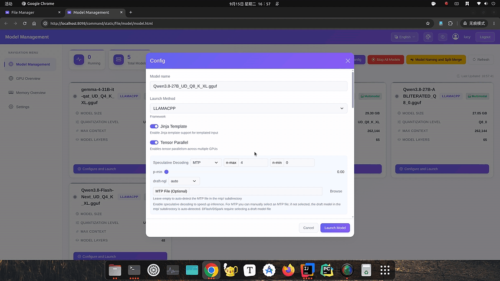

# 混合大模型一站式管理系统 (Hybrid LLM Management System)

> ### 🌐 Language / 语言
> [**English**](README.md) | **中文**

[](https://www.oracle.com/java/technologies/downloads/)
[](https://spring.io/projects/spring-boot)
[](https://github.com/ggml-org/llama.cpp)
[](#)
[](https://github.com/zhoujianguowei/hybrid-llm-management-system/releases)
[](LICENSE)



> 📺 **完整演示视频**(时长 5 分 25 秒，720p，约 6.6MB)：[demo-preview.mp4](demo-preview.mp4)

**📖 目录**

- [📋 项目简介](#-项目简介)
- [🌟 功能详情](#-功能详情)
- [🏷️ 版本信息](#-版本信息)
- [❗ 兼容性与已知限制](#-兼容性与已知限制)
- [🚀 快速开始](#-快速开始)
- [🛠️ 安装说明](#-安装说明)
- [🧩 构建与开发](#-构建与开发)
- [👥 用户角色说明](#-用户角色说明)
- [💼 开源版与完全版](#-开源版与完全版)
- [❓ 常见问题 (FAQ)](#-常见问题-faq)
- [📮 联系方式与支持](#-联系方式与支持)

---

## 📋 项目简介

本系统（混合大模型管理系统 / Hybrid LLM Management System）是一套面向本地部署大语言模型的综合管理平台，集 **文件管理、用户权限、模型调度、AI 对话、系统监控** 于一体，提供安全、高效、便捷的一站式操作体验。

> 📌 **本仓库为系统的免费开源版（基础版，Apache-2.0）**，包含文件管理、权限体系、AI 对话、用户管理等核心功能；完全版（Ultimate Edition，闭源商业版）在其之上增加 llama.cpp 本地模型调度、思考模式自动检测、资源监控、定时开关机等高级功能。两者关系与获取方式见 [开源版与完全版](#-开源版与完全版)。

系统基于 **Java + Spring Boot** 构建（前端采用 Bootstrap 5），后端通过 **llama.cpp** 调度本地 GGUF 格式的大语言模型，同时支持 **OpenAI 兼容**的远程 API 接入。其核心目标是解决本地模型部署中繁琐的路径权限管理、模型参数配置以及资源监控问题。

> 🤖 **关于 AI 辅助**：本项目的前端界面代码及部分配套脚本在 AI 编码助手辅助下完成，并经过人工审查与测试。这完全符合开源实践，不影响功能与可维护性。若你希望对 AI 生成内容有更严格的把控，欢迎在 Code Review / Issue 中指出具体问题。

### ✨ 亮点特性

| 特性 | 说明 |
| :--- | :--- |
| 🔥 **思考模式自动检测** | 通过识别 GGUF 文件内置的 Jinja 模板，自动检测模型是否支持思考模式，启动时与对话运行时均可灵活选择思考等级，无需手动配置。已验证支持：unsloth 量化的 qwen3.8 系列、gemma4、hy3、deepseek-v4-flash-0731、inkling-small、minimax-m3 等常见开源模型 |
| ⚡ **深度集成 llama.cpp** | 全面支持多 GPU 并行加速（SM Tensor）与预测推理（Speculative Decoding）加速，涵盖 MTP (Multi-Token Prediction)、DFlash、DSpark 三种类型，显著提升大模型推理的吞吐量与响应速度 |
| 🔒 **完全离线，开箱即用** | 前端资源 100% 本地化，不依赖任何外网 CDN，确保在极高安全要求的内网环境下依然能够流畅运行 |
| 🚀 **零配置部署 & 跨平台** | 全面兼容 Windows、Linux、macOS 三大主流平台；无需安装与配置数据库，采用单 Jar 包部署模式，真正实现"启动即运行" |
| 🛡️ **细粒度路径权限** | 基于路径继承的权限校验机制，涵盖读取、执行、上传、下载、删除五类核心权限，支持角色最小权限限制及特定用户额外授权，确保私有数据的绝对安全 |
| 📂 **项目级 AI 代码分析** | 支持文件批量上传并自动提取文本内容，可将整个源代码目录中的关键文件一次性提交给 AI，实现跨文件的项目级代码分析与重构建议 |
| ⚙️ **GGUF 自动化生命周期管理** | 自动识别 GGUF 分片文件并支持一键合并，内置严格的命名规范检查，确保模型文件统一且易于检索调度 |
| 📊 **实时资源监控面板** | 集成 `nvidia-smi` 实现实时监控，提供 GPU 显存使用率和系统内存的动态趋势图表，帮助管理员在启动模型前精准评估资源可用性 |
| ⏰ **智能定时开关机** | 支持一次性及周期性（按工作日）定时关机/唤醒任务，内置任务冲突检测与到期预警，是无人值守服务器环境的理想选择 |


---

## 🌟 功能详情

> 💡 以下部分截图为完全版界面示意；开源版（Base）不含模型管理、资源监控、定时开关机等【完全版】标识的功能入口。

### 1. 深度集成 llama.cpp 推理引擎【完全版】

> 💡 本节模型调度能力属于完全版；开源版通过 OpenAI 兼容 API 接入任意已部署的推理服务（llama.cpp server / Ollama / vLLM 等）进行 AI 对话。

**可选集成 ik_llama.cpp 作为推理引擎（非必填）**：配置该路径后，启动模型时可在 llama.cpp 与 ik_llama.cpp 两种推理引擎之间切换。ik_llama.cpp 分支在并发处理和部分量化模型加速方面表现更佳，为追求极致性能的用户提供了额外的灵活度。（注：GGUF 自动分片合并底层仍基于 llama.cpp，ik_llama.cpp 产生的分片需要手动合并。）


- **多 GPU 并行加速**：全面支持 llama.cpp 的 **SM Tensor** 调度，实现多卡并行推理。
- **MTP 预测加速**：支持 **Multi-Token Prediction** 多 Token 预测，涵盖 DSpark、DFlash、MTP，显著减少推理步数；支持设置 n-min、draft-ngl 等预测解码参数；MTP draft 文件自动检测 mtp/ 目录并支持手动选择，DFlash/DSpark 须配置 `.gguf` 格式 draft 模型
- **多种量化格式支持**：支持 F32/BF16/F16Q8_0/Q8_0、Q6_K、Q5_K_M、Q4_K_M、IQ3_XXS 等常见量化类型。
- **GGUF 自动化管理**：
  - 自动识别分片文件（如 `model-00001-of-00002.gguf`）并一键合并
  - 内置命名规范检查，确保模型文件命名统一（格式：`模型名_量化类型.gguf`）
  - 自动匹配 `mmproj` 多模态投影文件和 `mtp` Draft 模型文件
- **精细化启动参数**：UI 配置自动映射为 llama.cpp 命令行参数，支持上下文大小、GPU 加载层数、并行任务数、张量分割、KV Cache 量化、温度、线程数、批处理大小、模型加载模式（`--load-mode` / `--lazy-mode`，仅适用于 llama.cpp，不适用于 ik_llama.cpp）等全面调优。
- **思考模式参数映射**：思考模式配置自动转换为 `--chat-template-kwargs`，向 llama.cpp server 下发 `enable_thinking` / `reasoning_effort` / `thinking_mode` 等参数。

<details>
<summary><b>支持的 llama.cpp 启动参数一览</b></summary>

| 分类 | UI 配置项 | llama.cpp 参数 | 说明 |
|----|--------|------------|----|
| 文本采样 | 温度 | `--temp` | 控制生成随机性，0 为贪婪解码 |
| 文本采样 | Top K | `--top-k` | 概率排名前 K 截断，-1 禁用 |
| 文本采样 | Top P | `--top-p` | 核采样，累积概率截断 |
| 文本采样 | Min P | `--min-p` | 相对最高概率的相对阈值截断 |
| 文本采样 | 重复惩罚 | `--repeat-penalty` | 对已出现 Token 打折 |
| 文本采样 | 重复最后 N | `--repeat-last-n` | 重复惩罚追溯窗口 |
| 文本采样 | 存在惩罚 | `--presence-penalty` | 出现即惩罚，鼓励换话题 |
| 文本采样 | 频率惩罚 | `--frequency-penalty` | 按出现次数成比例惩罚 |
| 硬件调度 | 上下文大小 | `-c` | KV Cache 长度 |
| 硬件调度 | GPU 加载层数 | `-ngl` | 0 表示纯 CPU 推理 |
| 硬件调度 | 生成线程 | `--threads` | Decoding 阶段 CPU 线程数 |
| 硬件调度 | 批处理线程 | `--threads-batch` | Prefill 阶段 CPU 线程数 |
| 硬件调度 | 逻辑批处理 | `-b` | Prefill 单次并行 Token 上限 |
| 硬件调度 | 物理批处理 | `-ub` | 微批次大小，防显存溢出 |
| 硬件调度 | GPU 选择 | `selectedGpuIds` | 指定权重卸载到哪些 GPU |
| 硬件调度 | 张量分割 | `--tensor-split` | 多 GPU 显存分配比例 |
| 硬件调度 | 主 GPU | `CUDA_VISIBLE_DEVICES` 重排 | 主卡置于逻辑设备 0，无需 `-mg` |
| 硬件调度 | 张量并行 | `-sm tensor/graph` | SM Tensor 多卡并行加速 |
| 硬件调度 | 模型加载模式 | `--load-mode` | mmap+mlock / mlock / mmap / auto / none / dio（仅 llama.cpp） |
| 硬件调度 | 懒加载模式 | `--lazy-mode` | off / auto / on，需配合 auto 或 mmap 加载模式（仅 llama.cpp） |
| 预测推理 | 类型 | `--spec-type` | MTP / DFlash / DSpark |
| 预测推理 | n-max / n-min / p-min | `--spec-draft-n-max` / `--spec-draft-n-min` / `--spec-draft-p-min` | 草稿 Token 数与接受阈值 |
| 预测推理 | draft-ngl | `--gpu-layers-draft` | Draft 模型 GPU 层数，支持数值 / auto / all |
| 预测推理 | Draft 模型 | `--model-draft` | DFlash/DSpark 手动指定；MTP 自动探测 mtp/ 目录 |
| 缓存与状态 | 缓存大小 | `--cache-ram` | 上下文缓存容量上限 (MiB) |
| 缓存与状态 | KV Cache 量化 | `-ctk` / `-ctv` | K/V 缓存量化类型（f16 / q8_0 / q4_0 等） |
| 缓存与状态 | 检查点步长 | `--checkpoint-min-step` | KV 检查点最小间隔 |
| 缓存与状态 | 检查点数量 | `--ctx-checkpoints` | 每 slot 最大检查点数 |
| 其他服务 | 端口号 | `--port` | 模型服务监听端口 |
| 其他服务 | 并行任务数 | `--parallel` | 并发请求数 |
| 其他服务 | Jinja 模板 | `--jinja` | 启用 Jinja2 聊天模板解析 |
| 其他服务 | MOE 层数 | `--n-cpu-moe` | CPU 加载的 MoE 专家层数 |
| 思考模式 | 思考模式配置 | `--chat-template-kwargs` | 自动下发 enable_thinking / reasoning_effort / thinking_mode |

</details>


### 2. 智能 AI 对话

> 💡 开源版需在系统设置中配置 OpenAI 兼容 API；完全版支持对本地调度启动的模型自动检测能力与思考模式（Jinja 模板解析），无需手动配置。


- **对话管理**：支持新建对话、加载历史、删除会话、重命名、置顶常用会话。
- **多方式附件上传**：
  - 文件上传：支持复制文件路径方式上传，也支持剪切板拷贝的图片上传，支持常见文本格式和图片格式
    
  - 文件夹上传：支持整个文件目录列表上传。若模型支持图片输入则包含图片文件，否则仅包含纯文本文件
    

- **代码生成**：AI 生成的代码块支持一键复制、保存为本地文件，长代码支持折叠显示。
- **消息渲染**：支持 Markdown 语法高亮、LaTeX 公式渲染与沙箱 HTML 预览面板，并在回复中显示当前模型名称。
- **深度思考模式**：支持 unsloth 量化的 qwen3.8 系列、gemma4、hy3、deepseek-v4-flash-0731、inkling-small、minimax-m3 等模型的深度思考功能。
- **系统级配置**：管理员可配置 OpenAI API 接入、模型功能定义（正则匹配开启/关闭思考模式，支持覆盖本地模型自动检测的功能/思考模式），按角色限制附件大小和最大消息数。
- **对话统计**：实时显示 prompt prefill 速度、decode 速度、缓存命中 token 数、当前对话上下文占比等性能指标（**仅 llama.cpp 引擎提供完整统计**，其他引擎目前仅显示已使用的 token 数）。

#### 系统设置

管理员在 AI 对话页打开"系统设置"弹窗，包含三个配置标签页：

| 标签页 | 功能 |
|----|----|
| **OpenAI 接入** | 配置 OpenAI 兼容 API 端点与 Key（支持连接测试），开源版模型库的主要来源 |
| **模型配置** | 模型功能定义与思考模式配置（见下文） |
| **会话设置** | 按角色限制附件大小、最大消息数等配额，防止资源滥用 |

#### 模型功能定义与思考模式

"模型配置"标签页用于为匹配特定名称的模型定义多模态能力、思考模式与可见范围：

- **匹配方式**：支持**精确匹配**与**正则匹配**模型名称，一条配置可覆盖一个模型或一整个模型系列（如 `qwen3\.8.*`）。
- **多模态能力定义**：按模型声明图片 / 视频 / 音频输入能力，决定聊天附件入口（当前版本实际多模态能力仅支持图片）。
- **可见范围**：可设置模型对全部用户、普通用户及以上或仅管理员可见。
- **思考模式配置**：为支持"深度思考"的模型选择以下四种模式之一，并勾选可用的思考档位：

| 模式 | 使用参数 | 说明 | 适用示例 |
|----|----|----|----|
| 单独思考模式 | `enable_thinking` / `thinking` | 布尔开关，只有开/关没有强度档 | qwen3.5 / qwen3.6 |
| 多阶段思考模式 | `reasoning_effort` | 单参数同时控制开关与强度（`no_think` / `low` / `medium` / `high` / `xhigh` / `max`） | hy3 |
| 混合模式 | `enable_thinking` + `reasoning_effort` | 布尔参数控制开关，`reasoning_effort` 控制强度 | qwen3.8、deepseek-v4-flash |
| Thinking 模式 | `thinking_mode` | 三态值 `disabled` / `adaptive` / `enabled`，GGUF 元数据中检测优先级最高 | minimax-m3 |

- **GGUF 自动检测（完全版）**：本地启动 GGUF 模型时自动解析聊天模板元数据，检测 `thinking_mode` / `enable_thinking` / `reasoning_effort` 等思考参数并自动填充配置，通常无需手动定义。
- **覆盖自动检测**：模型功能定义中的该开关决定与自动检测结果的优先级——开启后本配置强制覆盖自动检测出的功能与思考配置；关闭时自动检测的本地模型以检测结果为准（可见范围始终生效）。开源版无本地模型自动检测，功能定义直接生效。
- **参数映射**：思考模式配置在发送给模型请求时自动转换为 llama.cpp 的 `--chat-template-kwargs` 参数（如 `enable_thinking=true,reasoning_effort="high"`）。

更多操作截图与细节见应用内使用指南（登录页"使用指南"入口）。

### 3. 文件管理


- **智能上传**：支持文件拖拽上传和大文件分片上传，右侧任务栏实时显示每个分片的上传进度和整体百分比。

- **灵活下载**：支持文件或文件夹下载。单个文件直接下载，文件夹自动在后台打包为 `.zip` 压缩包，可在下载任务列表中查看压缩进度。
- **多媒体预览**：支持多种格式在线预览，无需下载即可查看内容。
  - 图片 (JPG, PNG)：支持全屏查看
  - 视频：支持 Range 请求，可随意拖动进度条
  - 文档 (PDF)：支持在线预览
  - 文本/代码：支持 TXT、Java、Python、JS、HTML、JSON、YAML 等常见文本格式预览
- **搜索**：支持文件名模糊匹配，可使用通配符（如 `*.py`）快速筛选特定类型文件。
- **视图切换**：支持列表视图（显示详细属性）与平铺视图（适合图片浏览）切换。
- **安全删除**：删除操作需二次确认，严格校验 `DELETE` 权限，受保护路径即使管理员也无法删除。

### 4. 细粒度权限体系


- **路径继承机制**：访问文件时若未设置规则，系统自动向上追溯至父目录，直到找到最近匹配规则。

- **权限级联 (优先级)**：**删除 > 上传 > 下载 > 执行 > 读取**，高级权限自动包含低级权限。
- **角色与用户双重校验**：每项权限可配置最小允许角色，同时支持添加特定授权用户名单。
- **路径穿透 (Path Penetration)**：即使没有父目录执行权限，只要拥有深层文件的读取权限即可直接访问。
- **权限树管理**：可视化树形结构，直观查看整个系统的权限分布，快速定位并修改特定子目录权限。
- **路径保护机制**：受保护路径在文件管理界面显示特殊标识，所有删除请求直接拦截。

### 5. 用户全生命周期管理


- **角色管理**：支持管理员 (Admin)、普通用户 (User)、访客 (Guest) 三种角色，可随时切换。
- **状态控制**：一键封禁/解封，被封禁用户登录时触发解封申请流程，管理员可实时处理。
- **访客有效期**：可配置访客账号默认有效期（天数），系统定期扫描过期账号并自动封禁。
- **自助注册**：开启访客注册后，用户可在登录页自助注册，账号自动获得预设有效期。

### 6. 实时资源监控【完全版】


- **GPU 监控**：集成 `nvidia-smi` 实时解析，每 10 秒同步一次数据，记录最近 60 个样本的趋势图，直观查看每张显卡类型和显存占用。

- **内存监控**：实时显示总内存、已用内存、可用内存及整体使用率百分比，绘制近 3 分钟内存使用波动曲线，帮助分析模型加载时的内存峰值。

### 7. 智能定时重启【完全版】


- **双模式任务**：
  - 一次性任务：执行一次后自动删除，适合临时维护和单次实验
  - 周期性任务：可指定工作日，到期后自动计算下一周期，适合每日定时关机/唤醒
- **任务管理**：查看所有已创建任务，包括执行时间、状态（待执行/执行中/已过期）及实时倒计时，支持删除或推迟执行。
- **到期预警**：任务距离执行时间不足 10 分钟时，页面顶部弹出倒计时警告卡片。


---

## 🏷 版本信息

### 版本说明

> 💡 **自 v1.13 起 (release_base)，基础版正式转为免费开源，无任何授权与有效期限制**；此前购买过低版本基础版授权的用户不受影响、可继续使用，v1.13 及以上版本直接免费使用，无需任何费用。

| 版本 | 获取方式 | 说明 | 包含功能 |
| :--- | :--- | :--- | :--- |
| **开源版 (Base)** | 本仓库源码 / 发布包 `release_base` | 免费开源，Apache-2.0 | 文件管理、用户管理、AI 聊天（配置 OpenAI 兼容 API）、权限体系等核心功能 |
| **完全版 (Ultimate)** | 发布包 `release_ultimate` | 闭源商业版，一次性买断 | 开源版全部功能 + llama.cpp 本地模型调度、思考模式自动检测、资源监控、定时开关机等高级功能 |

### 版本历史变更

| 版本 | 变更内容 |
| :--- | :--- |
| **v1.13** | 1. 新增 --load-mode、--lazy-mode 两个启动参数（仅适用于 llama.cpp，不适用于 ik_llama.cpp）<br />2. 预测解码增强：新增 n-min、draft-ngl 参数；MTP draft 文件支持手动选择（留空自动检测 mtp/ 目录）；DFlash/DSpark 必填 .gguf draft 并实时校验，启动前校验文件存在性<br />3. AI 对话增强：模型功能配置支持覆盖本地自动检测的功能/思考模式；思考等级校验放宽（不再强制要求提供非思考等级）；思考模式下拉框新增悬浮说明；新增沙箱 HTML 预览面板、LaTeX 公式渲染，消息渲染中增加模型名称显示<br />4. 修复重启模型未复用上次成功端口、模型停止流程加固、会话标题被自动标题覆盖、每轮速度展示缺失、会话切换滚动抖动、消息渲染正文被误解析为列表、分片上传因文件被改动中断、大目录删除超时等问题<br />5. 登录会话有效期由 2 小时延长至 12 小时，WebSocket 空闲超时由 1 小时延长至 10 小时 |
| **v1.12** | 1. 新增 llama.cpp Speculative Decoding（预测推理）支持，涵盖 DSpark、DFlash、MTP 三种类型，并支持设置 n-max 和 p-min 参数<br />2. AI 对话功能增强：支持 Markdown 语法高亮、OpenAI 请求携带思考内容开关，以及运行时动态修改 temperature、top-p 等参数<br />3. OpenAI 请求兼容性增强：由仅支持 llama.cpp 扩展至支持 Ollama、kTransformer、sglang 等主流推理引擎（非 llama.cpp 引擎暂不支持查看 decode/prefill 速度等详细数据）<br />4. 修复文件列表上传、AI 对话特殊字符转义错误等已知问题 |
| **v1.11** | 1. 修复模型思考模式自动检测 bug，新增 inkling-small、minimax-m3 以及 deepseek-v4-flash-0731 模型的思考模式自动检测<br />2. 修复模型参数导入 bug、AI 对话页面代码渲染问题<br />3. AI 对话页面 UI 显示优化 |
| **v1.1** | 1. 完全版 AI 对话支持本地模型自动检测，无需手动配置 API，支持模型启动时或对话运行时选择思考等级，已自测验证 unsloth 的 qwen3.6、gemma4、deepseek-v4-flash 以及 hy3 等模型<br />2. 新增英语语言支持，界面支持中/英切换<br />3. 增加更多 llama.cpp 参数支持，包括主 GPU、repeat-penalty、top-k、top-p 等参数<br />4. 修复部分 bug，包括 AI 对话窗口异常关闭提示、路径搜索弹窗高度异常等问题 |
| **v1.0** | 首个发布版本，实现文件管理、AI 对话、用户管理、模型管理、定时开关机等基础功能 |

> 💡 上表仅列出主要版本变更，完整更新记录请见 [Releases](https://github.com/zhoujianguowei/hybrid-llm-management-system/releases)。

---

## ❗ 兼容性与已知限制

| 项目 | 说明 |
| :--- | :--- |
| **多模态能力** | 当前版本多模态能力 **仅支持图片输入**，不支持音频和视频输入。 |
| **对话统计数据** | 完整的对话统计（prefill / decode 速度、cached tokens 等指标）**仅适用于 llama.cpp 启动的模型**；其他推理引擎（Ollama、vLLM、sglang 等）当前仅显示已使用的 token 数。 |
| **定时关机/重启** | 该功能依赖于底层操作系统的指令集及硬件支持，并非所有机型均能正常运行。已测试环境：双路 X99 (Ubuntu 22.04, E5-2696 v4) 和 Mac M1 Pro 关机/重启均正常；Windows 10 64位 (z690 主板, i7-13700K) 关机功能正常，但自动唤醒重启受主板 BIOS 限制，自测无法唤醒。 |
| **GPU 监控** | GPU 监控功能依赖 `nvidia-smi` 工具，**仅支持搭载 NVIDIA 显卡的系统**。macOS 系统使用 Apple Silicon (M 系列) 或集成显卡，无对应监控接口，因此 macOS 下不提供 GPU 监控面板（内存监控不受影响）。 |
| **思考模式自动检测** | GGUF 思考模式自动检测目前基于正则匹配解析内置 Jinja 模板，个别模型可能存在检测不准的情况；此时可在 AI 聊天的系统设置 → 模型配置中手动配置思考等级以覆盖自动检测结果（详见 [常见问题](#-常见问题-faq)）。 |
| **依赖与安全基线** | 为保持 JDK 8 兼容性，当前依赖锁定于 Spring Boot 2.1.x / fastjson 1.2.83 等版本；已知依赖风险、安全建议（默认口令、Swagger 开关等）与升级计划详见 [SECURITY.md](SECURITY.md)，生产部署前请务必阅读。 |

---

## 🚀 快速开始

1. **准备环境**：安装 JDK 8 及以上版本（完全版还需下载 [llama.cpp](https://github.com/ggml-org/llama.cpp/releases) 可执行文件，详见 [安装说明](#-安装说明)）。
2. **下载运行**：下载[最新发布包](https://github.com/zhoujianguowei/hybrid-llm-management-system/releases)（开源版无授权限制），或直接[从源码构建](#-构建与开发)；解压后运行对应平台的启动脚本即可。
3. **登录配置**：浏览器打开 [http://localhost:8098/command/static/file/login.html](http://localhost:8098/command/static/file/login.html)，初始账号密码为 `admin` / `admin`，首次登录成功后请修改账号密码。

---

## 🛠 安装说明

> 以下以 **Windows 系统**为例演示完整安装流程，Linux / macOS 操作类似。

### 官方测试环境参考

- **OS**: Windows 10 64-bit / Ubuntu 22.04 LTS / macOS (M1 Pro)
- **CPU**: Intel i7-13700K / Dual Xeon E5-2696 v4
- **GPU**: NVIDIA RTX 2080 Ti (11GB/22GB Modified)
- **RAM**: 32GB / 128GB DDR4

### 安装步骤（Windows 演示）

**1. 安装 JDK**

安装 [JDK 8 及以上版本](https://www.oracle.com/java/technologies/downloads/#java8)（推荐 JDK 8，该版本经过多平台测试），并将 Java 可执行路径添加到系统环境变量。Linux 或 macOS 系统需要将 java bin 路径添加到 PATH 中。


**2. 安装 llama.cpp(完全版需要)**

开源版无需此步骤。下载并解压 [llama.cpp releases](https://github.com/ggml-org/llama.cpp/releases)（按自身平台选择）。**对于 NVIDIA 显卡的 Windows 系统，还需要下载对应的 cudart 资源，并放入解压后的目录中**（例如 CUDA 版本为 13.3 则下载 cudart 13.3）。


**3. 下载并解压发布包**

下载[最新版本的压缩包文件](https://github.com/zhoujianguowei/hybrid-llm-management-system/releases)，解压后运行对应的启动脚本即可，可根据需要调整 JVM 参数。


**4. 启动服务并完成基础配置**

Jar 包启动完成后，浏览器打开 [http://localhost:8098/command/static/file/login.html](http://localhost:8098/command/static/file/login.html)。初始账号密码为 `admin` / `admin`，首次登录成功后需要修改账号密码。


**5. 查看使用指南**

登录成功后，可点击工具栏页面的问号按钮查看详细的使用指南以及功能说明。开源版无需任何授权即可直接使用；完全版的授权更新方式见 [开源版与完全版](#-开源版与完全版)。


以下步骤（6 ~ 8）为完全版本地模型调度配置；开源版跳过即可，直接在 AI 聊天的系统设置中配置 OpenAI 兼容 API。

**6. 配置模型管理**

首次进入模型管理页面，需要填写模型 GGUF 文件所在目录以及 llama.cpp 执行文件所在目录，填写完成后系统会自动识别出模型列表。**模型命名与分片合并** 按钮可查看详细的 GGUF 文件目录及命名规范，同时支持 GGUF 分片自动检测合并。


**7. 配置 GPU 监控（可选，仅 NVIDIA 显卡）**

使用 `where nvidia-smi` (Windows) 或 `which nvidia-smi` (Linux/macOS) 查看 `nvidia-smi` 所在系统路径，并添加到模型设置页面，添加完成后即可查看 GPU 信息。


**8. 启动模型**


**9. 开始 AI 对话**

**v1.1 及以上版本的完全版支持本地部署模型自动检测，无需配置 OpenAI API 和模型思考等级参数；开源版则需在系统设置中配置 OpenAI 兼容 API。**


---

## 🧩 构建与开发

### 环境要求

- JDK 8 及以上（推荐 JDK 8 / 11）
- Gradle：无需安装，使用仓库内置 Wrapper（`./gradlew` / `gradlew.bat`）

### 从源码构建

```bash
# 编译并生成可执行 jar: build/libs/hybridLLM-v1.13_release_base.jar
./gradlew bootJar

# 打包三平台发布包（jar + 启动脚本）:
# base-hybridLLM-v1.13-windows-amd64.zip / linux-amd64.tar.gz / darwin-arm64.tar.gz
./gradlew buildJar

# 运行
java -jar build/libs/hybridLLM-v1.13_release_base.jar
```

浏览器访问 `http://localhost:8098/command/static/file/login.html`，默认账号 `admin` / `admin`（**首次登录后请立即修改**）。

### 主要配置项

配置文件位于 `src/main/resources/application.yml`（默认激活 `sit` profile）：

| 配置项 | 默认值 | 说明 |
| :--- | :--- | :--- |
| `server.port` | `8098` | 服务端口 |
| `server.servlet.context-path` | `/command` | 上下文路径 |
| `spring.servlet.multipart.max-file-size` | `200MB` | 单文件上传大小上限 |
| `swagger.enable` | `true` | Swagger 文档开关，**生产环境建议设为 false** |
| `llm.version` | `v1.13_release_base` | 版本号标识（开源版固定为 `release_base`） |

文件存储目录、AI 功能定义、附件大小限制等运行期配置在登录后的系统设置页面中维护（默认保存于数据目录，无外部数据库依赖）。

### 项目结构

```
src/main/java/com/grw/xiaobai/hybrid/llm/
├── controller/   REST 接口层
├── service/      业务接口 + impl 实现
├── manager/      内存态配置/状态管理（会话、权限树、上传任务等）
├── entity/       按领域划分的 POJO（chat/file/model/user/...）
├── config/       Spring 配置（MVC、线程池、Swagger 等）
├── task/         定时任务
└── utils/        工具类
src/main/resources/static/        前端静态资源（原生 JS + Bootstrap 5，无 Node 构建链）
```

分层约定：`controller → service → manager → entity`；系统无数据库，用户/权限/任务等状态持久化于磁盘文件、运行态保存在内存。

### 其他开发资料

- 贡献指南与代码规范：[CONTRIBUTING.md](CONTRIBUTING.md)
- 安全建议与已知事项：[SECURITY.md](SECURITY.md)
- 版本变更记录：[CHANGELOG.md](CHANGELOG.md)
- 第三方组件及许可：[NOTICE](NOTICE)

---

## 👥 用户角色说明

| 角色 | 权限级别 | 说明 | 可访问功能 |
| :--- | :--- | :--- | :--- |
| **管理员 (Admin)** | 最高 (Level 3) | 系统维护者 | 全部功能：文件管理、用户管理、模型管理、资源监控、定时关机、全局配置 |
| **普通用户 (User)** | 标准 (Level 2) | 正式注册用户 | 文件管理（受权限约束）、AI 聊天、个人设置；账号具有有效期，到期自动封禁 |
| **访客 (Guest)** | 临时 (Level 1) | 自助注册账号 | 文件管理（受权限约束）、AI 聊天、个人设置；账号具有有效期，到期自动封禁 |

---

## 💼 开源版与完全版

> 说明：**自 v1.13 的 release_base 起，基础版正式免费开源，无授权、无有效期限制**；历史版本的基础版授权继续有效，v1.13+ 无需授权即可直接使用。

本仓库为系统的**免费开源版 (Base)**，基于 **Apache-2.0 协议**发布：可自由商用与二次开发（请保留原 LICENSE 与 NOTICE 声明，项目名称与标识不在授权范围内）。

**完全版 (Ultimate Edition)** 为闭源商业版本，在开源版之上增加 llama.cpp 本地模型调度、思考模式自动检测、资源监控、定时开关机等高级功能，并确保持续的迭代与支持。

**完全版授权与购买：**

- 完全版发布包默认内置 **30 天全功能免费试用**，试用结束后可一次性买断终身授权。
- 完全版采用**纯离线一机一码**机制，机器码由 CPU / 主板 / 操作系统生成，更换显卡、硬盘、内存等外设不影响授权；详细授权规则见完全版发布包内说明。
- 请在 Wise 付款页面的 **备注/备忘录 (Notes/Reference)** 中填写您的 **本机机器码 (Machine Code)** 以及 **接收授权码的电子邮箱**；如支付时漏填，请将付款凭证与机器码发送至 `zhoujianguowei@gmail.com`（24 小时内人工签发）。

| 软件版本 | 终身买断价格 | 离线支付链接 |
| :--- | :--- | :--- |
| 👑 **完全版 (Ultimate Edition)** | **$19** / 终身 | [点击通过 Wise 购买](https://wise.com/pay/r/-5LpLO3Vcn6x4Cc) |

> **🔒 隐私保证**：系统运行期间 100% 隔离外部网络，无任何遥测或数据收集行为；开源版代码完全公开，可随时审计。

---

## ❓ 常见问题 (FAQ)

**Q：开源版和完全版有什么区别？**

A：开源版即本仓库代码，基于 Apache-2.0 免费开源，包含文件管理、用户管理、AI 聊天（需配置 OpenAI 兼容 API）、权限体系等核心功能；完全版在其之上增加 llama.cpp 本地模型调度、思考模式自动检测、资源监控、定时开关机等高级功能，为闭源买断制。两者关系详见 [开源版与完全版](#-开源版与完全版)。

**Q：macOS 为什么没有 GPU 监控面板？**

A：GPU 监控依赖 `nvidia-smi` 工具，仅支持搭载 NVIDIA 显卡的系统。macOS 使用 Apple Silicon (M 系列) 或集成显卡，无对应监控接口，因此 macOS 下不提供 GPU 监控面板（内存监控不受影响）。

**Q：Windows 下定时关机后无法自动唤醒重启？**

A：定时唤醒依赖主板 BIOS 的硬件支持，部分机型（如 z690 主板 + i7-13700K 自测环境）无法自动唤醒，属于 BIOS/硬件限制；关机功能本身不受影响。

**Q：（完全版）更换显卡/硬盘/内存会导致授权失效吗？**

A：不会。机器码由 CPU、主板与操作系统共同计算生成，日常更换显卡、硬盘、内存、电源等外设均不影响授权；仅在重装系统或更换 CPU/主板时才会变更。

**Q：完全版试用期限是多久？如何购买？**

A：完全版默认内置 30 天全功能免费试用。试用期满后可通过 [Wise 支付链接](#-开源版与完全版) 购买终身买断授权（完全版 $19），付款时请在备注中填写本机机器码与接收邮箱。

**Q：为什么 AI 对话提示需要配置 OpenAI API？**

A：开源版作为标准 API 客户端使用 AI 对话，需要在系统设置中配置 OpenAI 兼容 API（可以是本机已启动的 llama.cpp server、Ollama 等）；v1.1 及以上的完全版支持本地调度部署的模型自动检测，此种场景下无需手动配置 API。

**Q：模型思考模式自动检测不正确怎么办？**

A：完全版的 GGUF 思考模式自动检测目前采用正则匹配实现，对部分模型可能存在检测错误。这种情况下可在 AI 聊天的系统设置中的模型配置里手动配置思考等级进行覆盖（支持"覆盖自动检测"）。

---

## 📮 联系方式与支持

- **项目地址**：[github.com/zhoujianguowei/hybrid-llm-management-system](https://github.com/zhoujianguowei/hybrid-llm-management-system)
- **下载发布**：[Releases 页面](https://github.com/zhoujianguowei/hybrid-llm-management-system/releases)
- **问题反馈**：欢迎通过 GitHub Issues 提交 Bug 与功能建议
- **授权/购买咨询**：`zhoujianguowei@gmail.com`
